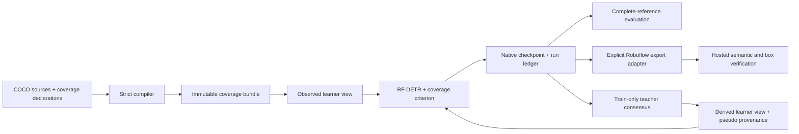

# Architecture and reproducibility

## Trust boundary



A content-addressed manifest lists every payload and its hash. A bundle contains all supplied splits and source provenance. A learner view contains only train/validation data, dense canonical class mappings and image/class coverage. Test data and the withheld training oracle do not enter the learner view.

Source declarations control whether a missing label can supervise a negative. `exhaustive` and `verified_absent` allow it; `unknown` and `positive_only` do not. Observed positives remain supervised in every state. The compiler validates consistency and identities, not the truth of a human completeness assertion.

## Training contracts

The adapter targets RF-DETR **1.10.1** and its IoU-aware BCE detection path. Matching, box losses, group normalization and auxiliary dispatch stay upstream by default. The custom classification implementation masks unreduced image/query/class cells. It preserves the K semantic classes and reserved output slot separately.

Initialization starts from official RF-DETR Nano or Large weights, resetting all main and encoder classifier heads to the same seeded K+1 state. A parameter digest proves matched starts. Initialization is published atomically, preventing cancellation from leaving a plausible but incomplete weight file. Runs record configuration, model variant, seed, step count, dataset digest, initialization digest, device, exact checkpoint hash and completion status. Saved checkpoints carry their architecture and resolution; reload rejects unsupported variants. Evaluation verifies the checkpoint ontology and complete-reference coverage; coverage never hides false positives.

The initial GPU experiment is three arms × three seeds on two chess tasks, 2,000 updates each. Stage two starts from the corresponding stage-one detector and restarts optimizer state for a further 2,000 updates. Aware variants share the exact starting detector. Naive and complete controls receive the same augmented 512px recipe. Extra teacher forward passes are additional compute, so equal optimizer steps are not equal FLOPs.

The construction task is independently sourced. Its protocol specifies three arms from the same official initialization per seed, at 512px with augmentation and 4,000 updates. Four of nine runs completed before interruption: all three arms for the first seed and naive for the second seed. The predeclared nine-checkpoint test evaluation has not run; the 91 test images remain unevaluated. The original waiting script is stopped while its required matrix is incomplete.

The capacity pilot changes to officially pretrained RF-DETR Large (2026 weights), 704px inputs, four decoder layers and upstream EMA, with 2,000 updates from fresh initialization. All three cloud arms completed for one seed: 72.78 naive, 73.68 aware and 74.97 complete AP50:95. The aware result is 0.69 points above its same-seed Nano/512px control, which used 4,000 total updates. This tests the combined recipe; it does not isolate architecture size, resolution, EMA or training-budget effects. Separate Apple-MPS execution is not pooled with CUDA replicates. The CLI accepts `initialize --variant large`, `train --recipe large_fresh`, and an explicit device. Real CPU train/save/reload and 20-update MPS smoke checks also passed.

Nano recipes export final training weights. The Large recipe installs upstream `RFDETREMACallback` and exports its EMA weights at the fixed final update. In-training validation is disabled for this EMA path; complete-reference evaluation runs after export with the common evaluator. Export type is recorded in the run ledger. A smoke test is not evidence of convergence or an accuracy improvement.

Plain exports now include the top-level upstream `model_name` and architecture overrides required by `RFDETR.from_checkpoint(...)`. Existing Nano/512px and Large/704px checkpoints were rewrapped without changing their source files, loaded with the public SDK and compared for exact parameter equality. The continuation Nano model retains its original positional-encoding size instead of inferring a different architecture from resolution.

The completed Large aware model itself also passed public-SDK tensor/class-name parity after export. Independent local rescoring of saved predictions reproduced every metric for all three Large arms; this is an evaluation audit, not another training replicate.

## Teacher provenance

The teacher only reads training images in the partial learner view. Each proposed box must have confidence ≥0.70 in original and horizontally mirrored views, agree at IoU≥0.60, belong to a class without exhaustive coverage, and avoid an existing observed box. Accepted coordinates are confidence-weighted averages. Class-aware NMS and greedy one-to-one agreement suppress duplicates. Conflicting human boxes take precedence.

Every accepted box records its image, class, confidence, view agreement and teacher checkpoint hash. Coverage is never promoted. The returned manifest and annotations can reconstruct the exact remote learner artifact locally with `restore_teacher_view`.

The cautious-box ablations preserve `is_pseudo` through the upstream COCO conversion and arbitrary instance filtering/crops/flips. Human boxes keep full regression weight; pseudo boxes may receive 0.1 or zero regression weight while their positive classification supervision remains. Weighted box normalization preserves the observed-box scale. These are experiments, not assumptions that teacher labels are correct. Multi-process distributed training is explicitly rejected for weighted pseudo-box experiments until reviewed.

## Experimental crop refinement

One predeclared pilot trains a class-agnostic coordinate refiner from the all-class partial view's **994 observed human boxes**, excluding pseudo labels and hidden reference boxes. It uses ImageNet ResNet18 features, frozen BatchNorm, 4×4 spatial pooling and 224px crops with 1.5× context. Integer floor/ceil crop bounds and black padding have an explicit inverse coordinate transform. Zero correction reproduces the input proposal.

Training uses 1,000 updates, batch 32, seed 20260917 and a fixed final checkpoint. Proposals have center/scale jitter, horizontal flips and 25% exact identity proposals so training includes boxes that need no correction. Loss is `5 × SmoothL1(beta=1/9)` on normalized crop corners plus `2 × GIoU`. Encoder/head learning rates are 1e-5/1e-3.

The same partial-trained refiner is applied to seed-20260917 naive, aware and complete Nano/512px detections. Classes and confidence scores are preserved. Eligible boxes must have positive area and confidence ≥0.05; only the top 100 eligible boxes per image are corrected. Finite zero-area boxes remain unchanged in the scored prediction set and are excluded before this top-100 selection, so they do not consume correction slots. The complete-label detector also receives this partial-trained postprocessor, so it is not a separately complete-trained refinement reference. No validation checkpoint selection is allowed. Primary promotion requires improved aware AP against the unchanged evaluator.

The first cloud attempt finished all 1,000 updates, then failed when inference validation rejected finite zero-area RF-DETR outputs; its temporary checkpoint could not be recovered. The revised workflow separates durable training output from evaluation: cloud training returns the checkpoint first, the client verifies its SHA, seed, completed updates and training-view digest, writes a receipt, then evaluates all three controls locally. Restarting evaluation reuses that collected checkpoint and verifies any existing evaluation's bindings. A later evaluation failure therefore does not require retraining.

The retry checkpoint was collected and verified. Its local MPS evaluation failed because 7×7-to-4×4 adaptive pooling is unsupported by that backend. Evaluation now defaults to CPU, retaining the exact trained architecture; an explicit environment override is possible. This recovery required no new cloud call. Evaluation records device, inference time, image count and changed-box count alongside accuracy. The original cloud failure remains under `attempts/1`.

All three CPU evaluations completed: naive 69.21 → 69.33, aware 73.00 → 72.55, complete 74.06 → 73.29 AP50:95. The primary aware result regressed by 0.44 points, so the refiner is not promoted. The aware pass changed 1,026 boxes across 58 images in 23.19 seconds, including checkpoint load/crop preparation and excluding detector inference/COCO scoring. The actual retry training took 98.45 seconds for 1,000 updates. These are measured runtime scopes, not end-to-end serving latency or total cloud billing.

## Observed-object crops and sliced inference

The construction continuation adds a dataset wrapper that replays a hashed **8,000-sample plan**: 4,000 full-frame samples and 4,000 class-balanced crops anchored to observed human boxes. The plan is derived solely from the partial training view and shared by aware, naive and complete crop arms. The complete arm's extra labels affect supervision, never crop selection. Dense image IDs and coverage states remain unchanged; all intersecting observed targets are transformed using upstream crop/flip/resize. JPEG draft decoding is disabled before applying rectangles expressed in original pixels. Deterministic sample choices do not depend on model RNG or an arm's annotation count.

Four fixed continuations add 2,000 updates to their respective 4,000-update Nano/512px parents. The primary pair shares the same aware parent: crop-aware versus ordinary aware continuation with stock augmentation. This tests sampling, object scale and augmentation together. Full-frame scores are 47.28 crop-aware versus 48.00 ordinary aware, 43.17 crop-naive and 52.45 crop-complete. The primary effect is negative; these one-seed results remain separate from the original multi-seed cohort.

Tiled inference is a separate CPU diagnostic. A 640px image receives its full-frame pass and four 384px tiles with stride 256. Tile coordinates map back to the original image; detections touching internal tile boundaries within two pixels are rejected. Class-aware CPU NMS uses IoU 0.5 and a score floor of 0.001. Raw full-frame and full-frame-plus-NMS controls distinguish tiling from suppression effects. The original aware checkpoint scores 48.14 raw, 47.44 with full-frame NMS alone and 48.96 with full-frame-plus-tiles. It is five image passes, not equal inference cost.

A secondary class-routing rule uses only partial human training-box sizes: classes with median longest side ≤96px at model scale use the tiled output; other classes retain raw full-frame output. Here those classes are `helmet` and `no-helmet`. It scores 49.84 aware versus 48.14 fresh full-frame; naive/complete score 46.89/53.99. The rule's design was informed by prior validation findings and remains exploratory.

The four-way crop-training/tiled-inference interaction was declared before primary continuation scoring. All four cases completed: full tiling scores 45.84 crop-aware, 47.82 ordinary-aware, 42.31 crop-naive and 52.36 crop-complete, below their corresponding full-frame scores. The same class-routing rule gives 48.06 crop-aware, 49.88 ordinary-aware, 43.87 crop-naive and 53.87 crop-complete. These remain secondary inference results; they do not reverse the negative primary crop-training comparison. All classes and all 120 validation images remain included, and test labels remain unused.

MPS raw-output and postprocessing comparisons failed the recorded parity checks. These diagnostics therefore use CPU for every matched policy. Small fresh-CPU differences from historic scores are reported instead of overwriting the historical evaluator results. No exact CPU/MPS parity is claimed. The best ordinary-aware continuation with routing is 49.8821, only 0.0403 points above the original aware checkpoint with that same routing.

The completed annotation audit read only the partial learner training view and complete validation references, checked their manifest hashes and inspected all 33 observed no-helmet training boxes plus all 11 validation boxes. It found sparse supervision, a size shift, inconsistent head geometry and specific annotation defects; it also recorded genuine detector errors. No hidden training labels, test data, annotation edits or split changes were involved. The proposed annotation-review/acquisition workflow is deferred and is not an implemented feature or launched experiment. The immutable original benchmark remains the reported reference.

## Local workbench

The FastAPI app binds to loopback. Mutating requests require a client header and matching origin; uploaded ZIP paths, symlinks, duplicate members and extraction sizes are validated. This is a local single-user tool, not a hardened multi-tenant internet service.

SQLite WAL stores projects, revisions, jobs and events. Policy changes create new revisions and reject stale saves. The scheduler uses a filesystem lock and transactional claims so only one worker is active per workspace. Workers run in separate process groups, persist progress/results atomically and survive a webserver restart. Cancellation checks process identity before signaling; a dead worker becomes interrupted rather than completed.

Large datasets/checkpoints remain in the filesystem. The database records immutable identities and paths. Job prediction inspection reads the reference bundle bound to that job, not whichever revision is currently selected.

The training form selects local CPU or Apple MPS and Nano/384px, augmented Nano/512px or Large/704px/EMA recipes. Backend device checks reject unavailable hardware. Device and recipe are explicit job inputs and initialization remains architecture-specific. Eleven focused tests and desktop/mobile checks passed for these controls; browser submissions were intercepted, so this is distinct from the separately completed real MPS training smoke test.

## Cloud snapshots

The user-facing local queue does not implicitly launch cloud work. Research clients submit explicit Modal functions. Each uses pinned `cloud-requirements.txt`, a frozen code tree, baked dataset ZIPs, bounded CPU/RAM/GPU resources, hard timeouts, no automatic retries, no persistent Volumes and zero minimum containers.

Input ZIPs are addressed by SHA-256 and contain partial/complete views plus a separate evaluation reference. The selected training path remains explicit. Teacher functions receive only the partial view. Function call IDs are written before result collection; restarting a client reattaches instead of blindly submitting duplicates. Returned checkpoints and metrics must match the request and their mutual hashes before a receipt is accepted.

The actual executed snapshots and their manifests are under `artifacts/modal/`. Local edits after a deployment do not alter that deployment. Existing experiment snapshots must be kept for provenance; create a new snapshot directory for subsequent code. Do not rewrite the recorded source manifest to pretend older experiments ran newer code.

Provider accounting is currently disputed. The API reported $32.68 metered and $2.68 billed after $30 credits; the user reports $12.91 remaining credits, $25.41 workspace usage and no visible card charge. No actual payment was verified. All four owned apps were initially stopped and zero containers verified. The user subsequently authorized continued compute. Reservations are $3.30 for three Large runs, $1.70 for two refinement attempts and $4.40 for four construction continuations: $9.40 maximum after restart. Failed work remains counted and the older interrupted cohorts remain stopped. Local tiling adds no cloud compute. Reserved maximums are not actual metered costs or a reconciled credit balance.

`training/cloud_budget.py` checks a persistent local execution policy before cloud submission/deployment. Capacity and refinement launches reserve their worst-case allowance under a filesystem lock before submission. The reservation ledger is separate from delayed provider usage, and an app allowlist prevents old clients from silently restarting other cohorts. A failed attempt retains its reservation until explicitly reconciled. This controls these clients' planned commitments; it does not prove provider billing correctness or impose an account-wide spending limit. Policy and reservation files live outside the repository under `~/.config/coveragecv/`.

### Reproduce an initial chess batch

After `coveragecv demo` has prepared grouped data and official weights:

```sh
uv run --no-sync python - <<'PY'
from pathlib import Path
import shutil
from coveragecv.training.modal_runner import freeze_input
source = Path('artifacts/modal/source/coveragecv')
shutil.copytree('src/coveragecv', source, ignore=shutil.ignore_patterns('__pycache__'))
print(freeze_input('artifacts/chess_experiment.json'))
PY
uv run --no-sync modal deploy -m coveragecv.training.modal_runner
uv run --no-sync python - <<'PY'
from coveragecv.training.modal_runner import run_batch
run_batch()
PY
```

This incurs provider compute and is a reproduction sequence, not the current restart instruction. The current local cloud policy deliberately blocks this older app. Confirm account credits, provider limits and a reservation for concurrent commitments before running a new batch; a user-reported $0 spend limit did not settle the accounting discrepancy above. Do not use `shutil.copytree(..., dirs_exist_ok=True)` to overwrite a snapshot already bound to saved experiments; choose a new snapshot/configuration deliberately.

### Expanded tasks and recipes

- `coveragecv.full_chess.prepare_full_chess()` creates the 13-class task on the existing frozen chess groups.
- `coveragecv.construction.prepare()` downloads the pinned industrial dataset, checks source hashes, groups exact/name/perceptual matches, repairs cross-split groups and builds partial/complete views.
- `coveragecv.training.modal_runner.freeze_input(...)` freezes either experiment into the baked input directory.
- `coveragecv.training.modal_improve` supports `COVERAGECV_MODAL_APP` and `COVERAGECV_MODAL_SOURCE` for a separate deployment/snapshot. Deploy with `modal deploy -m coveragecv.training.modal_improve` so the package import path matches the image.
- `scripts/run_improvement_matrix.py` collects the declared stage-two methods; it waits for missing stage-one receipts and reuses stored call IDs.
- `scripts/run_construction.py` submits/reattaches the nine industrial runs to the prepared `coveragecv-ablation` deployment.
- `scripts/collect_experiments.py` verifies collected checkpoints, computes seed summaries and adopts complete comparisons into the workbench.
- `scripts/evaluate_construction_holdout.py` waits for all nine industrial runs, then evaluates the predeclared test protocol locally.
- `coveragecv.training.modal_capacity` and `scripts/run_capacity.py` implement the separate bounded Large/704px/EMA cohort. The client reserves allowance before a new call; interrupted attempts retain their prior receipts.
- `scripts/evaluate_ensembles.py` applies the declared equal-weight three-seed weighted-box-fusion protocol to saved predictions, using no ground truth during fusion. It requires no GPU training. The completed aware ensembles did not improve AP and are not promoted.
- `coveragecv.training.modal_refine` and `scripts/run_refinement.py` implement the fixed crop-refinement pilot, reserving each attempt's allowance before cloud submission. The trained checkpoint is collected and hash-verified before separate local evaluation on all three predeclared baseline checkpoints.

These scripts target this project's pinned benchmark protocols. They are not a general hosted training scheduler. The initial collector's all-runs completion condition must account for interrupted cohorts before it is reused. Cloud results persist locally when collected; Modal's retained call outputs should not be treated as a permanent artifact store.

## Evidence and limitations

Metrics use COCO AP50:95, common stock postprocessing, and a fixed score threshold of 0.25 for precision/recall/false positives. Input resize follows the evaluator recorded in source; exported checkpoints record their inference resolution. A refactored common scorer reproduced the full saved metric dictionary for the checked reference run. Seed summaries show sample standard deviation, not confidence intervals. Actual seed counts are shown per method: interrupted runs are excluded, never treated as zeros. Paired comparisons use only matching seeds and budgets. No independent-domain claim is made for the two chess projections.

Construction grouping uses source basename, exact bytes and normal/mirrored 64-bit dHash distance≤4. Two recognized groups crossed original splits; their members were moved together to the higher holdout split (test>validation>train). This is a reproducible leakage reduction, not proof of camera or scene independence. Reference completeness is inherited from source annotations, and pretraining exposure to these public datasets is not established.

Error categories are greedy diagnostics at the fixed threshold, not a reproduction of TIDE causal AP attribution. The research dashboard preserves every completed recipe and includes regressions. Teacher training is inspired by established sparse/semi-supervised detection work, including [Co-mining](https://arxiv.org/abs/2012.01950) and [Soft Teacher](https://arxiv.org/abs/2106.09018); this implementation is simpler and is not presented as a reproduction or a new scientific algorithm.

[RESULTS.json](RESULTS.json) is a portable snapshot of collected aggregates, individual checkpoint/data identities, validation metrics, incomplete cohorts and verification evidence. It omits predictions, image paths, private credentials and machine-specific absolute paths. The full ignored local artifacts remain necessary to independently rerun evaluation; hashes establish identity, not independent verification by a reader who lacks the files.

Final handoff verification passed 122 tests. All seven original/continuation tiled and class-routing comparisons are collected. Every project Modal app reports zero containers at the recorded final check; further experiments and the proposed acquisition workflow are deferred.
