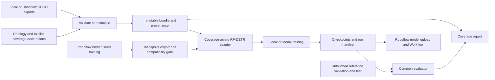

# Coverage-Aware Dataset Compiler — architecture decision record

Prepared September 17, 2026. Status: design, not an implemented or tested system. Working package/CLI name: `coveragecv`. The name is provisional. This document is the integration contract; supporting research lives in the adjacent data, training, compute, reuse, and adversarial documents.

## 1. What we are building

A reproducible data compiler and RF-DETR training adapter that preserve the difference between an object class being absent and its labels being unknown. A user supplies datasets, explicit class mappings, and declarations of what each source actually annotated. The compiler validates those declarations, produces a reproducible bundle, and explains which training signals are justified. The adapter consumes the same contract during every detection classification-loss calculation.

The motivating example is two datasets: one labels white pawns, the other black pawns, while both types appear in the images. Combining their annotations normally makes unannotated target objects contribute negative supervision. Our system records the annotation policy and suppresses only the unjustified classification cells. It does not generate missing boxes or guarantee an accuracy improvement.

The deliverable is valuable in three independently inspectable ways: a strict data contract, a correct and narrow integration with a real detector, and a measured experiment. A frontend without the first two is insufficient. A masked-loss patch without the data provenance and evaluation is also insufficient.

## 2. Selected boundaries

| Decision | Initial implementation | Reason |
|---|---|---|
| Runtime | Python library and CLI; offline report | Easy to inspect, reproduce, and integrate; no always-on services required. |
| Input | COCO object detection plus explicit coverage manifest | One well-defined contract before general format conversion. A dataset preparation script can convert the selected YOLO benchmark. |
| Coverage granularity | Whole image × semantic class | Enough to test the motivating multi-source problem; region-level coverage requires different geometry semantics. |
| Model | Apache-designated RF-DETR Nano | Actual Roboflow model, compact fine-tuning workload. |
| Version | RF-DETR 1.10.1, commit `e3fc28795f2a4303069c6b72e80431e5ed716030` | Stable reviewed source rather than moving `develop`. Dependency compatibility remains an execution gate. |
| Loss | Default IoU-aware BCE detection path | Exact parity can be checked against a single upstream implementation. |
| Compute | Roboflow hosted base training where export permits; local CPU correctness; one Modal GPU for custom-loss continuation | Prefer existing Roboflow credits while retaining control of the novel criterion. |
| Persistence | Immutable filesystem bundles and run directories; Modal Volume remotely | Clear artifact ownership and recoverability without a database. |
| UI | Static HTML coverage/prediction report generated from saved artifacts | Shareable, no server credentials, no running GPU to review results. |
| Roboflow integration | Required dataset/version provenance, hosted training where feasible, final model upload/Workflow | [Integration plan](ROBOFLOW_INTEGRATION.md) defines the hybrid and no-export fallback without assuming a custom hosted criterion hook. |

RF-DETR's [release](https://github.com/roboflow/rf-detr/releases/tag/1.10.1), [custom training API](https://rfdetr.roboflow.com/latest/learn/train/customization/), and [hosted training API](https://docs.roboflow.com/models/train/train-a-model) establish these integration boundaries. Current docs can move beyond the selected release: the pinned source wins when they disagree.

## 3. Component and data flow



The experiment controller also creates a naive branch and a complete-label reference branch. They use the same continuation images, locked split, initialization, allowed augmentations, optimizer schedule, and update budget. Only the intended supervision intervention differs. The complete-label reference contains more labels and is explicitly labeled as such. Hosted seed training uses a disjoint subset and is shared by every arm; when export is unavailable, use a common stock initialization and keep any hosted baseline outside the causal comparison.

## 4. Coverage is an assertion, not a guess

| State | Meaning at source import | Nonpositive classification cells | Explicit positive boxes |
|---|---|---|---|
| `exhaustive` | All instances of this class were annotated under the declared policy | Train as negatives | Retain full original positive-cell loss |
| `verified_absent` | A reviewer or trusted source policy establishes no instances | Train as negatives | Contradiction: reject |
| `positive_only` | Some instances are annotated; completeness is not asserted | Ignore | Retain full original positive-cell loss |
| `unknown` | No completeness/absence assertion | Ignore | Retain positive observations if present; do not infer completeness |

Unknown is the default. A class appearing in a dataset's class list does not establish exhaustive annotation. An image with zero boxes does not establish verified absence. Evidence includes source identifier/revision, annotating policy, declaration scope, and who or what asserted it. A manifest cannot prove an assertion true; the report must expose its origin.

The compiler accepts all four states, but the initial accuracy experiment hides entire classes per image. It does not claim to solve arbitrary missing instances within a class, class ambiguity, overlapping ontologies, or spatial ignore regions. `positive_only` has correct selective-supervision behavior, but a general same-class partial-annotation method is not established by that alone.

Images with no observed boxes and no semantic classes eligible for negative supervision are reported as having no task supervision. They are excluded from the main supervised experiment under the same fixed sample-selection policy for every arm. Keep them in the audit; never reclassify them as background. Direct criterion tests may still exercise these images.

## 5. Canonical bundle and identities

Proposed layout:

```text
bundle/<bundle_digest>/
  manifest.json                 schema, source pins, contract, logical file hashes
  ontology.json                 semantic keys, names, dense model indices
  splits/train.coco.json         observed training annotations only
  splits/valid.coco.json         complete-label validation reference
  splits/test.coco.json          complete-label test reference, evaluator-only
  coverage.jsonl                sample × class states and declaration references
  provenance.jsonl              source IDs, revisions, mapping and decisions
  images/<sha256>.<extension>    content-addressed image blobs
  diagnostics.json              machine-readable validation and coverage summary
```

For actual remote training, produce a train/validation-only view with its own digest; do not mount test labels or the hidden training-label oracle in the learner container. Keep the complete-label-reference arm in a separate input view. The experiment ledger relates these views to the parent dataset snapshot without letting the partial-label adapter read hidden labels.

Materialize the real RF-DETR `dataset_file="roboflow"` layout: `train/_annotations.coco.json`, `valid/_annotations.coco.json`, and verified images at the referenced relative paths. Copy or hardlink immutable image blobs while preserving globally assigned image IDs and identical flat category tables. Canonical bundle JSON paths are not directly consumable by the stock loader; setting `dataset_file="coco"` would select a different expected layout. Bind the view digest to the parent bundle and original index space; never renumber IDs while removing evaluator-only files.

Three identities must remain distinct:

1. **Image content identity:** SHA-256 of original file bytes. This finds exact duplicates, not equivalent encodings or visually similar scenes.
2. **Sample identity:** content identity plus source evidence and the compiler's explicitly resolved sample policy. V1 rejects conflicting observations of the same image rather than manufacturing a merge.
3. **Dense training identity:** deterministic `image_id` in `[0,N)`, global across bundle splits, for cheap table lookup. This is local to the bundle; store its mapping and bundle digest. It is not a permanent identity across dataset revisions.

Canonical JSON uses the existing [RFC 8785 implementation](https://github.com/trailofbits/rfc8785.py). We must additionally define sorted record order, exact ontology ordering, Unicode handling, and finite numeric bounds; serialization alone does not normalize semantically equivalent data. Preserve source strings and require explicit mapping instead of fuzzy/case-insensitive synonym matching. A separate run record contains timestamps and absolute local paths; these do not contaminate reproducible bundle identity.

The manifest's root digest is calculated over a canonical identity manifest listing payload digests, excluding the root digest field itself. The identity manifest includes schema/compiler versions and normalized compile configuration. No self-referential hashes. Files are written to a staging directory, verified, and atomically published on the same filesystem. Existing valid bundles are reused; incomplete staging directories are never consumed. Streaming hashes avoid loading all image bytes into memory. A complete bundle is the smallest unit sent to a worker.

## 6. Compiler pipeline and diagnostics

1. Parse manifests using strict schemas and reject unknown fields/schema versions. The schema API and JSON Schema export share one definition.
2. Validate source checksums, image existence/decode/dimensions, relative paths, class references, annotations, finite coordinates, positive box extent, and supported detection flags.
3. Resolve explicit class mappings into deterministic dense indices. Reject ambiguous mappings, contradictory target taxonomy, and class-policy changes without a declared revision.
4. Resolve coverage declarations and per-image overrides. Reject `verified_absent` paired with a positive annotation, unknown class keys, or undocumented region policies.
5. Check exact duplicates and split conflicts. Across splits, duplicate bytes are an error. Within a split, identical observations can coalesce; differing labels or coverage block V1. No implicit IoU-based box deduplication or union of conflicting evidence.
6. Check benchmark sample/group split assignments, reference-label custody, and coverage support for each target class. Near-duplicate/scene leakage is a separate reviewed diagnostic; exact hashes cannot certify independence.
7. Write the canonical bundle and an explanation for each dropped, rejected, or coalesced item.
8. Verify the written files and publish the bundle atomically. Compiler output is independent of source traversal order, worker count, source-list order where semantically equivalent, and wall-clock time.

Diagnostics include stable codes, source/sample/class identifiers, the conflicting evidence, and a remedy. Examples: `COVERAGE_ABSENCE_CONTRADICTION`, `ONTOLOGY_MAPPING_REQUIRED`, `IMAGE_SPLIT_COLLISION`, `DUPLICATE_OBSERVATION_CONFLICT`, `NO_NEGATIVE_COVERAGE`, `UNSUPPORTED_TRANSFORM`, `BUNDLE_DIGEST_MISMATCH`, and `COVERAGE_WOULD_BE_DROPPED`. Machine JSON goes to stdout when requested; human progress/errors go to stderr. No credentials or signed export URLs in either stream.

A conventional COCO consumer can ignore extra metadata. We cannot prevent external tools doing that. Therefore the normal training entrypoint requires a verified bundle; an explicit plain-COCO export emits a semantic-loss report and requires acknowledgement if coverage would be lost. Do not advertise ordinary exported COCO as automatically safe in stock hosted training.

## 7. Trainer integration and mathematical contract

Reuse the upstream detector, Hungarian matcher, box loss, training loop, checkpoint callbacks, and evaluation machinery. Implement a small version-specific criterion adapter and data/config checks. Avoid global monkey-patching or a fork of `training_step`.

For batch image `b`, query `q`, and semantic class `c`, define:

```text
N[b,c] = 1 when coverage is exhaustive or verified_absent, otherwise 0
P[b,q,c] = 1 for a real matched annotation of class c, otherwise 0
M[b,q,c] = N[b,c] OR P[b,q,c]

classification_loss = sum(M * original_unreduced_cell_loss) / upstream_num_boxes
```

The original IoU-aware BCE positive cell contains a soft target and both positive and negative terms. Preserve the **entire** matched-cell expression, its existing detach operations, and upstream normalizer. Multiplying only the negative-weight tensor by coverage would be incorrect. Do not renormalize by active class count: that would introduce a second intervention and break full-coverage parity.

At the selected version, the detector emits `K+1` logits for `K` semantic classes. The final reserved slot retains its upstream behavior and is not a new user class. It receives its original negative supervision; it must not be accidentally omitted, mapped to a dataset class, or globally masked. Consequently, an all-unknown sample does not imply total zero loss or unchanged model parameters. The strict claim is zero direct classification gradient at forbidden semantic cells.

The criterion's inherited `forward` rematches predictions at final, auxiliary decoder, and encoder outputs. Override `loss_labels(outputs, targets, indices, num_boxes, log=True, matched_targets=None)` and reuse that dispatch so coverage applies to every path. Preserve the `forward(..., num_boxes=None)` override and group-DETR normalization. Release 1.10.1 does not support padded ground-truth filler validity: reject padded targets rather than importing later develop semantics. Packed variable-length target transport and image padding are separate features. Compile is disabled for the first proof.

Coverage lookup happens at the **criterion boundary** from preserved dense `image_id` into an immutable tensor table. This avoids source converters discarding custom metadata and transform filters mistaking a class vector of length `K` for a vector of `K` bounding boxes. Gather batch rows in one tensor operation; do not add per-image GPU `.item()` synchronization. The lookup is bound to bundle/ontology digests and checked on load/resume. It enriches copies of target dictionaries, not shared dataset state.

Configure only verified single-image, label-preserving transforms for the initial experiment: resize, horizontal flip if appropriate, and normalization. Disable crop-based object dropping, mosaic, mixup, cutout, copy-paste, and arbitrary custom transforms until their semantics are implemented and tested. Reject unsupported transform settings rather than silently ignoring coverage. The pinned pipeline's actual target fields and class-index behavior must pass an end-to-end smoke test.

The pinned model's head resizing can tile/truncate pretrained class rows. For a new ontology, explicitly initialize all K+1 rows of every classification head using a seeded policy, including the reserved row, then save **one common initialized state**. For a compatible hosted model already trained on this exact ontology, preserve its trained heads instead. EMA is disabled in the first proof. Loading weights with permissive mismatch handling is not proof that heads were initialized correctly.

The pinned postprocessor ranks all K+1 output slots, while the COCO evaluator skips unmapped labels. Preserve common stock behavior across arms, explicitly log reserved-slot selections, and fail on any unmapped semantic class. A successful evaluation call alone does not prove class mapping is correct.

## 8. Experiment contract

The primary proposed small dataset is RF100 Chess Pieces via a pinned public mirror; exact class support and the stock-initialization withholding rules are in [DATA_PROTOCOL.md](DATA_PROTOCOL.md). The preferred hosted-base variant reserves a separate seed subset and recomputes continuation counts as specified in [ROBOFLOW_INTEGRATION.md](ROBOFLOW_INTEGRATION.md). Neither protocol proves absence from upstream pretraining or model-selection work. Complete-label means the original annotated reference, not guaranteed perfect annotations.

Required comparison arms:

| Arm | Observed training labels | Training loss | Purpose |
|---|---|---|---|
| `naive` | Controlled partial labels | Unmodified upstream criterion | Actual stock behavior |
| `aware` | Same partial labels | Coverage adapter | Isolate the proposed intervention |
| `complete_reference` | Original reference labels | Unmodified upstream criterion | Context for information lost by withholding; not a mathematical upper bound |

Include pre-fine-tuning evaluation and an all-exhaustive adapter-versus-stock parity check. Freeze the dataset and treatment assignment before comparing models. Save identical initial weights, schedule, batches, augmentation seeds, batch/accumulation, evaluation intervals, and step counts. Do not compare early-stopped runs with unequal budgets as a controlled fixed-budget result. A timeout is an incomplete arm; comparisons use common completed steps or rerun a smaller predeclared budget across all arms.

Validation selects configuration/checkpoints and any operating threshold. Test is used only after those choices are fixed. All test metrics use complete-label reference targets and an ordinary common COCO evaluator; coverage masks never hide evaluation false positives. Report AP@[.50:.95], AP50, per-class AP/precision/recall, false positives per image at a validation-chosen threshold, inference settings, train time, and exact run IDs. Aggregate over image or scene groups, not object-level bootstrap pretending every piece is independent. With very few test scenes, show the uncertainty and avoid a broad generalization claim.

A one-seed pilot supports a controlled preliminary observation. Three seeds, alternative withholding severity, a less-correlated external dataset, specialist models, and a measured pseudo-label-completion baseline strengthen later claims. They are separate experiments, not silently claimed by the first demo. If masking raises false positives or fails to help, publish that result and distinguish correct engineering from an unproven ML benefit.

## 9. Runtime, recovery, and reproducibility

One training invocation consumes a `RunSpec`: bundle digest, checkpoint digest, exact code and dependency locks, arm, seed, allowed transforms, update budget, GPU type, timeout, and artifact destination. Write it before starting. State transitions are `prepared → running → completed`, with explicit `failed`, `interrupted`, and `incomplete` states. Metrics are tagged with run and attempt IDs. Never reuse a completed path for a different specification.

Use a single GPU and one writer per run. Periodically save and commit a checkpoint including optimizer/scheduler/EMA state, global step, and available RNG/sampler state. Resume verifies identities and restores the supported state; if exact mid-epoch dataloader replay is unavailable, resume from the last completed epoch or restart the paired arms and record the limitation. A preempted run must not silently mix histories.

The Modal wrapper is thin: install locked dependencies, mount the train/validation view, execute the same CLI, persist artifacts, exit. Retried attempts share an experiment deadline and ledger so per-attempt timeout is not mistaken for a total-cost cap. GPU concurrency is one initially. No scheduled jobs or persistent inference endpoint are needed. Capture actual Torch/CUDA/driver/GPU versions in the run manifest.

Secrets stay outside bundles and reports. Modal authentication is local control-plane configuration. Only the Roboflow connector/orchestrator receives the Roboflow key; the custom-loss worker reads verified artifacts and does not need it. An offline report uses embedded or local reviewed images, escaped labels, and no credentials or remote tracking scripts.

## 10. Proposed repository modules and CLI

```text
src/coveragecv/
  schema.py                 contracts and generated JSON Schema
  compiler/                 validation, ontology, identities, atomic bundle writer
  coverage.py               semantic state rules and declarations
  adapters/coco.py          input/output boundary
  adapters/roboflow.py      version import/reconciliation and platform operations
  training/rfdetr_1101.py   small pinned criterion/model/data integration
  experiments/              RunSpec, withholding, paired runs, evaluation
  report/                   static report generation and prediction overlays
  cli.py                    command parsing and stable exit/diagnostic behavior
infra/modal_train.py        thin remote execution wrapper
examples/chess/             source pins and reproducible experiment specification
tests/                      compiler properties, gradient contracts, integration
third_party/                notices and any narrowly vendored modified function
```

Proposed commands, not yet implemented:

```text
coveragecv doctor
coveragecv prepare chess --output data/chess
coveragecv validate sources.json
coveragecv compile sources.json --output artifacts/bundles
coveragecv inspect BUNDLE --image SAMPLE
coveragecv train --run-spec RUN_JSON --provider local|modal
coveragecv roboflow preflight --workspace WORKSPACE
coveragecv roboflow train-base --experiment EXPERIMENT_JSON
coveragecv roboflow deploy --run RUN_DIR
coveragecv evaluate --run RUN_DIR --split test
coveragecv report --experiment EXPERIMENT_DIR
coveragecv export-coco BUNDLE --acknowledge-coverage-loss
```

The report should expose a dataset × class coverage matrix, original observations and hidden reference labels (clearly separated), source explanations, fixed-example prediction comparisons, full evaluation tables, and links to reproducible commands/artifacts. Clicking a sample should explain its supervision in ordinary language. Detailed gradients are available in an engineering view; users should not need loss-function terminology to understand why a source needs a declaration.

## 11. Definition of ready and done

Ready for paid training means the dependency import and one forward/backward step work; compiler invariants and stock-gradient parity pass; the source labels and class mapping are checked; each arm shares the same initialized state; train/validation/test identities are locked; expected throughput is measured; and billing caps plus artifact persistence are configured.

A complete first release contains an installable CLI, validated example, immutable bundle, tested trainer adapter, readable failure diagnostics, saved experimental evidence, static visual report, source notices, a reproducible runbook and the required Roboflow integration. Mark any uncompleted deployment gate explicitly. Distinguish tests actually passed, experiments actually completed, and hypotheses still open; no universal accuracy or native hosted-custom-loss claim is required.

## 12. Deliberately deferred extensions

Region-level coverage, arbitrary partially annotated instances, inferred ontology alignment, semantic/instance segmentation, multi-GPU normalization, arbitrary augmentation policies, web accounts, queues/databases, distributed object stores, additional detector frameworks, and a hosted SaaS are later extensions. Each requires a new contract and measurable use case; none is necessary to show the project's core value. A small library can later be wrapped in a service without changing the bundle or loss semantics.
