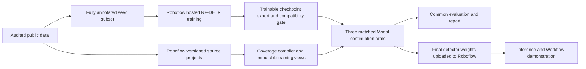

# Roboflow-first integration and hybrid training

Decision updated September 17, 2026 to reflect the user's requirement: **Roboflow is part of the delivered project; prefer its hosted training wherever the required behavior is available. Modal is the custom-code execution path.** No authenticated account capabilities or checkpoint import have been tested yet.

## What the public interfaces actually establish

| Capability | Public evidence | Consequence |
|---|---|---|
| Hosted RF-DETR training | [Training documentation](https://docs.roboflow.com/models/train/train-a-model) and [supported models](https://docs.roboflow.com/models/supported-models) | Use available Roboflow credits for a useful hosted run. Confirm the exact architecture/size in the workspace. |
| Recipe customization | [Python SDK `Version`](https://github.com/roboflow/roboflow-python/blob/main/roboflow/core/version.py) exposes `describe_train_recipe` and `create_training(..., train_recipe=...)` | Inspect the account's recipe schema before choosing execution. The SDK describes hyperparameters, augmentation and preprocessing; this is not evidence of arbitrary Python/criterion injection. Pin a released SDK exposing the selected API before execution. |
| Coverage-aware custom criterion | No such hook documented in the reviewed hosted training interface | Do not upload a sidecar and claim the hosted trainer uses it. The current plan executes our criterion on Modal. |
| Raw RF-DETR weights | [Download documentation](https://docs.roboflow.com/models/model-weights/download-roboflow-model-weights) lists PyTorch export, restricted to paid Core and some Enterprise accounts | Hosted-to-Modal continuation requires actual export entitlement and a compatible trainable checkpoint. Extra training credits alone do not establish either. |
| External RF-DETR model upload | [Custom weights documentation](https://docs.roboflow.com/models/model-weights/upload-custom-weights) and supported-model table | Upload the final model and test it through Roboflow Inference/Workflows. Exact Nano checkpoint packaging and output parity remain execution gates. |

The current [Public plan](https://roboflow.com/pricing) advertises 15 monthly credits, no credit card, hosted training, and public data/models. Core lists raw model-weight download. An individual grant may change the available balance or entitlements; use the actual workspace values. Do not buy a plan simply to satisfy this architecture.

## Preferred path: Roboflow base training, Modal continuation

Roboflow can perform the initial task training, followed by controlled continuation with our new supervision policy. We will report actual GPU time/updates per stage; no promise that most training compute happens on Roboflow before throughput and hosted recipe behavior are known. The novel coverage-aware training stage still needs our code.

### Data separation and protocol identity

1. Audit the original 202 training images for scene groups before allocating the seed subset. Keep the original validation/test partition independent, or freeze a documented group-aware revision if the audit finds leakage.
2. Create a deterministic seed subset targeting 40 training images, keeping known scene groups intact. Define each group key as SHA-256 of its canonical JSON sorted relative image paths. Rank groups by SHA-256 of `coverage-chess-hybrid-v1`, NUL, `20260917`, NUL and the group key; use group key to break ties. Take the shortest prefix with at least 40 images. Before training, require at least 10 seed images containing each class, and at least 30 both-class images plus 20 neither-class images in the continuation pool. If this fixed partition fails those viability checks, explicitly revise the protocol; do not search partitions using model outcomes. Record the actual group-preserving counts.
3. Train the Roboflow base only on complete seed-subset labels. It must not receive complete labels for the continuation images or final test labels. Validation labels may be used under the declared model-selection policy. Do not accept automatic reshuffling, auto-labeling, or dataset expansion silently.
4. The remaining original training images become the continuation pool. Apply the same deterministic alternating source assignment described in [DATA_PROTOCOL.md](DATA_PROTOCOL.md), with a new protocol namespace `coverage-chess-hybrid-v1`, only to this pool. Recompute all box/image/coverage counts. The original **202 images / 480 visible / 490 withheld** statistics belong to `coverage-chess-v1`, not this variant.
5. For the naive and aware arms, use identical partial annotations, source assignment, sample order, transforms and update budget. The complete-reference arm uses the same continuation images with complete reference labels. All three start from the exact same exported Roboflow base detector state.
6. Do not mix the seed images into only one continuation arm. The first hybrid comparison uses continuation images alone. Any later seed replay must be applied identically across arms and declared as a new protocol.

This answers a useful product question: can a detector trained on an initial fully annotated dataset be safely extended with datasets that annotated different classes? It is a different question from training directly on the complete 202-image partial-label mixture. Report the protocol name with every result. A mature seed model may also reduce the observable benefit; that is a valid result, not a reason to change the split after looking at test performance.

### Checkpoint import gate

Select ordinary RF-DETR object detection, preferably Nano, not RF-DETR NAS. The official download documentation excludes NAS weights export. Confirm a trainable PyTorch artifact is available; an ONNX inference graph is not the intended fine-tuning checkpoint.

Record model ID, training ID, dataset version, architecture configuration, exact class order, preprocessing, artifact SHA-256, and whether the selected weights are EMA or base weights. Load into the pinned trainer and explicitly account for every key and tensor shape. Run a forward/backward step, verify semantic class mapping, and compare predictions against the exported/hosted model on fixed validation inputs with matched preprocessing. Export availability is not proof of source-version compatibility.

For a correctly mapped two-class hosted model, **preserve the trained classifier heads**. Resetting them would discard part of the hosted training. If class order differs, explicitly permute every affected main/encoder head row and test it; never rely on a permissive state-dict load. Initialize fresh identical optimizers/schedulers for all continuation arms. Hosted optimizer state is not required for this declared fine-tuning protocol.

If the checkpoint cannot load faithfully, do not partially load it and continue describing the result as a faithful hosted-model continuation. Use the fallback below. Automatic inference cache download is documented for deployment; it is not our mechanism for obtaining an otherwise unavailable training export.

## Fallback that still uses Roboflow substantially

If raw export is unavailable or incompatible:

- Maintain the two partial-label source projects and immutable dataset versions in Roboflow, with coverage declarations and content correspondence tracked by our compiler.
- Run a useful hosted baseline using the available credits. Record its actual recipe and data inputs; evaluate it descriptively. It is a platform comparison, not the causal control for our custom loss, because initialization, augmentation and training internals may differ.
- Run the three controlled arms on Modal from one stock RF-DETR initialization with the explicit new-ontology head policy. This uses the original `coverage-chess-v1` 202-image protocol, unless a new protocol was frozen before training.
- Upload the selected custom detector back to Roboflow and demonstrate inference in a Workflow. If the particular hosted importer is incompatible, preserve the compiler/version integration and demonstrate a supported Roboflow Inference route after testing it; clearly identify which deployment gate remains incomplete.

No paid Roboflow upgrade is a prerequisite. Prefer the hybrid once entitlement and compatibility are established, otherwise execute this fallback without repeatedly revisiting permission questions.

## Dataset connector contract

Use a dedicated public demo workspace/project namespace. Create the two partial source projects with the same explicit two-class ontology, but different declared annotation coverage. Store coverage policy in our immutable sidecar; Roboflow project categories do not encode that policy themselves. Include a pointer/digest in project documentation where supported, while keeping the local manifest authoritative.

Pin workspace, project and generated version IDs. Disable generated augmentation and split reshuffling for this controlled demonstration. Record the actual exported image/annotation inventory. A Roboflow export may rename/re-encode images or remap category IDs: retain upload-to-export correspondence, test geometry, and bind the resulting bytes into a new snapshot. Do not assume source byte hashes survive a service round trip. Any unexplained dropped/duplicated image, changed annotation or split change fails reconciliation.

Source project exports must not bring complete hidden labels into the partial learner's view. Validation rows have complete reference coverage. Test images/labels are kept in the evaluator artifact and are not required in the hosted base-training project. If a hosted recipe requires a third internal split, allocate it from the seed pool and log the change; do not borrow the final test set.

For network operations, separate safe retryable reads from job-creating writes. Record a local operation identity and returned training/model IDs. On a timeout after submission, reconcile server state before retrying; never create multiple paid trainings because the initial response was lost. Capture resolved recipe/defaults where exposed, status transitions, failure diagnostics and available cost records. Redact keys and signed export URLs from saved logs.

## Final deployment contract

The training-only coverage table must not alter the exported inference network. Save a standard detector checkpoint using the packaging required by the selected RF-DETR uploader. Bind its model ID back to the experiment, bundle and class-map digests in our run ledger. Do not upload a Lightning object containing our custom criterion as though it were a standard inference checkpoint.

Use versioned model upload for traceability. The current SDK documentation exposes `version.deploy(model_type, model_path, filename)`; the exact RF-DETR type and file format will be pinned and tested during implementation. Keep model IDs explicit because a dataset version can contain multiple models.

The Workflow should show the uploaded detector's predictions and a useful downstream step, such as counting black and white pawns. It demonstrates the model completing a Roboflow lifecycle. It does not need to reimplement the compiler inside a Workflow or expose training internals to users.

Acceptance: exported weights load, inference classes/boxes/scores match the local model within a documented tolerance under matched preprocessing/postprocessing, fixed validation cases produce the expected output schema, and the report links the actual deployed model/Workflow. Cloud and local inference may use different numerical runtimes; report that boundary rather than claiming bitwise equality.

## First authenticated checks, before consuming credits

- Workspace identity, plan, current credits and training/export entitlements.
- Available ordinary RF-DETR sizes and the actual training recipe schema.
- Dataset version inventory and explicit preservation of experimental splits.
- Exact SDK APIs and model packaging supported by the installed release.
- Training credit estimate/cap behavior and whether overage is enabled. Do not assume a cap field documented for usage-based plans is available on Public.

These are execution checks, not unanswered architecture choices. The design has a useful route for each outcome. No account access or provider action has occurred during planning.
